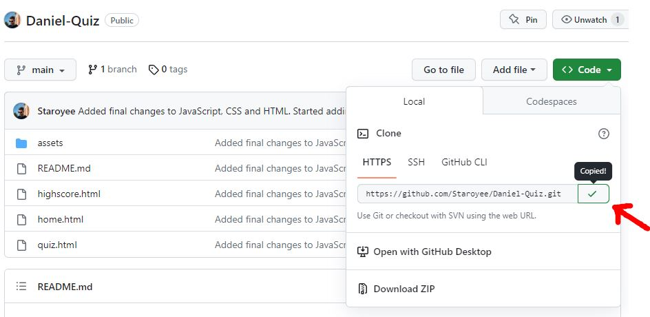
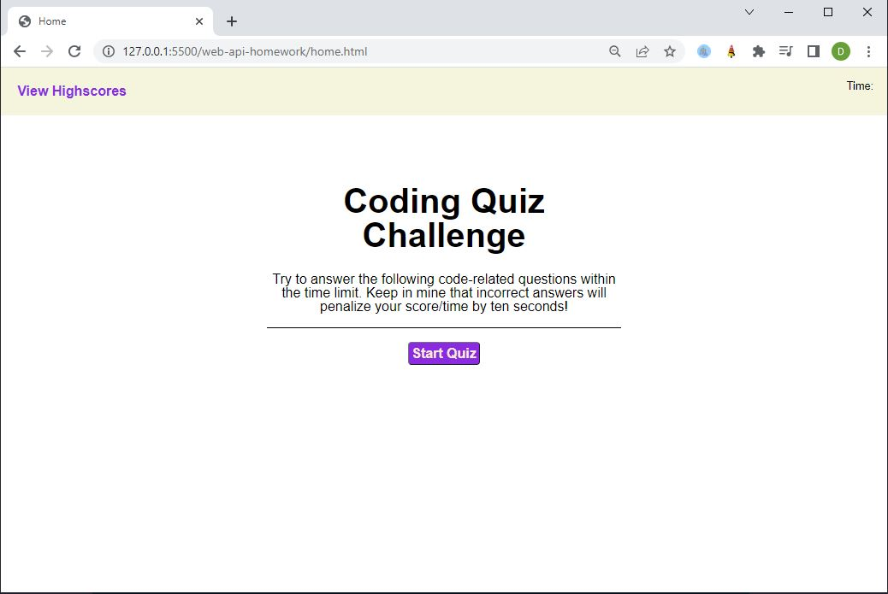
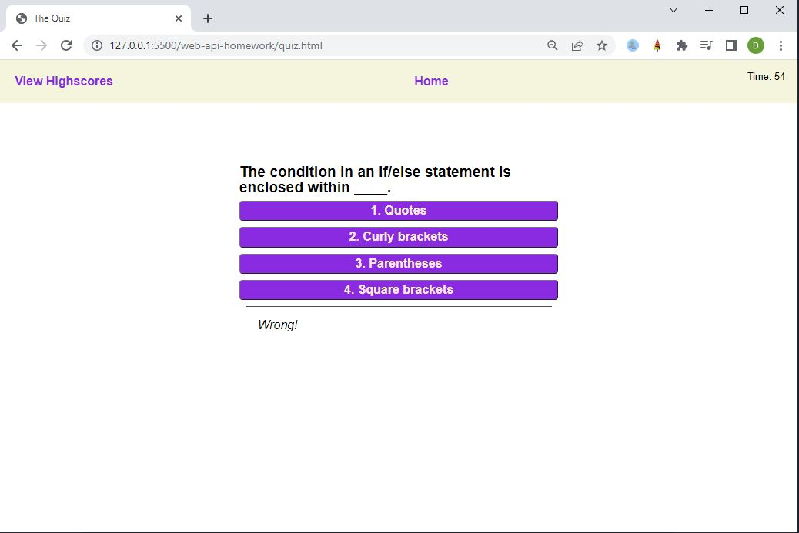
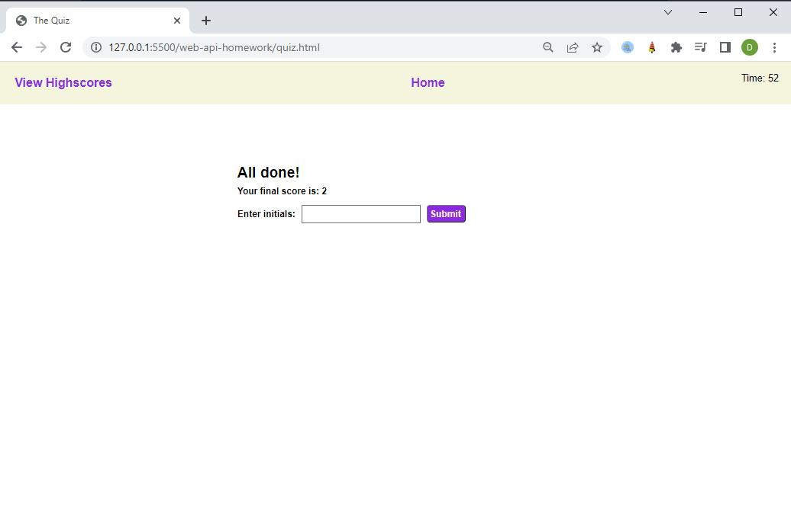
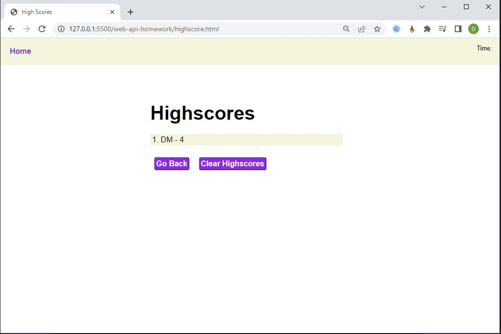
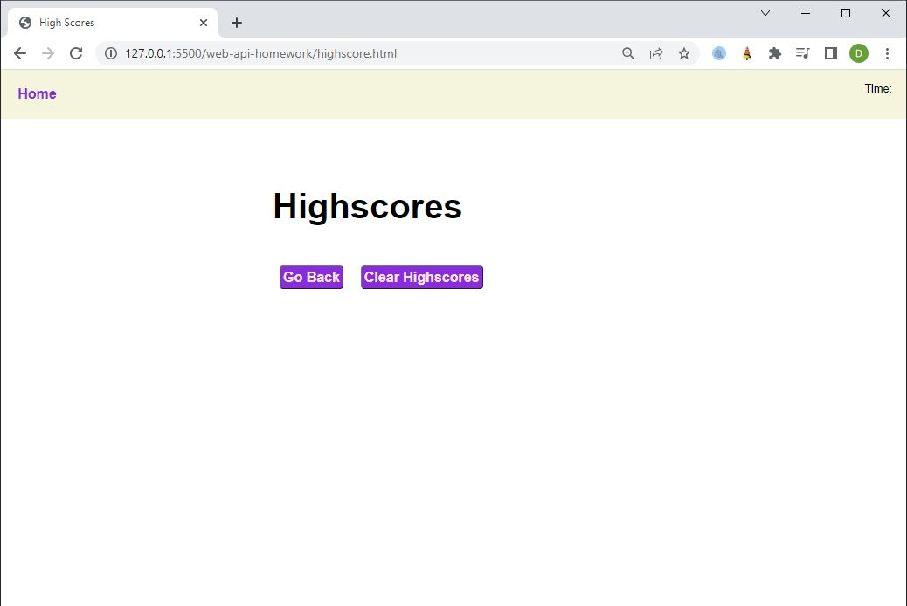

# Daniel-Quiz!

## Description
I was tasked create a functional quiz that is timed and uses JavaScript to manipulate the DOM.

I was motivated to undertake this task because I wished to gain a greater understanding of how to use JavaScript to manipulate HTML and CSS.

## Solve
The completion of this project provides the user with a functional timed quiz that they can take to test their knowledge on basic JavaScript.

The webpage is now deployed for use.

## I have learned:
* How to store objects within an array in localStorage, and retrieve them.
* how to set multiple object within an object variable.
* How to manipulate HTML and CSS (the DOM) using JavaScript.
* How to create and append elements to the HTML document.
* How to set attributes such as style to add CSS using JavaScript.
* How to set text content and inner text to created elements using JavaScript.

## Installation
Steps to install this project on your local PC
1. Open the termal on your machine.
2. Use the terminal command `cd` to navigate to the directory where we want the repository located.
3. Locate the 'Code' button on the 'Daniel-Quiz' github repository, click it, then copy the 'HTTPS' link to clipboard. (See image)

4. Use the git command `git clone` followed by the URL copied from Github to clone the repo to our machine.
5. The `git clone` command creates a new directory with the same name as the repository. We navigate into our new directory using `cd`.
6. The repository should now be cloned onto your device and able to be edited in VScode or another editing software.

## Instructions

To use the site:
1. Click 'Start Quiz'.
2. Try to answer the questions correctly by clicking on an option.
3. Continue through all questions before the time runs out.
4. Enter your initials and click submit to save your score.
5. Click 'Go Back' to return to the home page or 'Clear Highscores' to remove current highscores.

Navigation: (Navbar)
1. Use the 'Home' button to navigate to the home page.
2. Use the 'View Highscores' button to navigate to the highscores page.

## Deployed Application Link
* https://staroyee.github.io/Daniel-Quiz/

## Screenshot

## Credits
* https://developer.mozilla.org/en-US/docs/Web/Events/Creating_and_triggering_events
* https://developer.mozilla.org/en-US/docs/Web/API/EventTarget/addEventListener
* https://www.w3schools.com/js/js_if_else.asp
* https://developer.mozilla.org/en-US/docs/Learn/JavaScript/First_steps/Variables
* https://developer.mozilla.org/en-US/docs/Web/JavaScript/Data_structures
* https://developer.mozilla.org/en-US/docs/Web/JavaScript/Reference/Statements/for
* https://developer.mozilla.org/en-US/docs/Web/JavaScript/Guide/Functions
* https://developer.mozilla.org/en-US/docs/Web/JavaScript/Guide
* https://developer.mozilla.org/en-US/docs/Web/JavaScript/Guide/Working_with_Objects
* https://www.w3schools.com/js/js_loop_for.asp
* https://blog.logrocket.com/localstorage-javascript-complete-guide/
* https://developer.mozilla.org/en-US/docs/Web/JavaScript/Reference/Operators/Logical_OR
* https://stackoverflow.com/questions/37483144/how-to-store-multiple-items-on-local-storage-when-a-button-is-clicked
* https://developer.mozilla.org/en-US/docs/Web/API/Location/assign
* https://developer.mozilla.org/en-US/docs/Web/API/Element/setAttribute
* https://www.w3schools.com/jsref/met_document_createelement.asp
* https://developer.mozilla.org/en-US/docs/Web/API/setTimeout
* https://stackoverflow.com/questions/22143072/onclick-show-div-and-after-some-seconds-hide-my-shown-div
* https://blog.hubspot.com/website/how-to-bold-in-html#:~:text=You%20can%20also%20italicize%20text,it%20in%20our%20HTML%20examples.
* https://www.geeksforgeeks.org/how-to-creating-html-list-from-javascript-array/